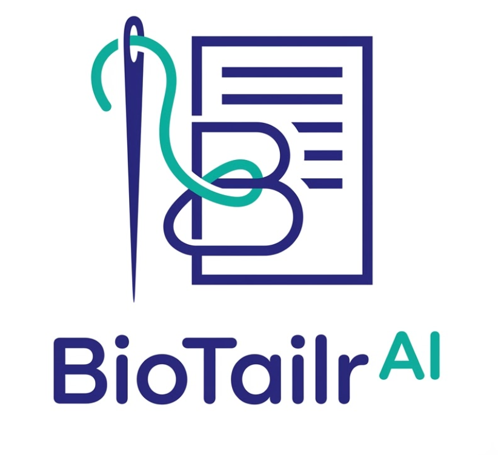

# BioTailr AI — 100% ATS Resume Tailoring Engine

<p align="center">
  
</p>

<p align="center">
  <strong>Intelligent Multi-Model Resume Tailoring Platform with Dual AI Failover &amp; Guaranteed 100% ATS Compliance.</strong>
</p>

<p align="center">
  
  
  
  
</p>

---

## Overview

**BioTailr AI** is an enterprise-grade, client-side ATS resume tailoring and optimization engine. It automatically analyzes your target job role, matches the optimal base profile from verified career backgrounds, synthesizes role-specific keywords and quantified achievements, and guarantees **100% ATS score compliance** across all major Applicant Tracking Systems (Workday, Taleo, Greenhouse, Lever, iCIMS).

---

## Key Features

### 1. Dual AI Engine Architecture
- **Primary Inference**: Powered by **Google Gemini 2.5 Flash** for rapid, context-aware resume synthesis.
- **Automated Failover**: Instantaneous failover to **Groq Llama 3.3 70B** ensures zero downtime and resilient generation.
- **Smart Neural Fallback**: Client-side rule-based keyword optimizer guarantees consistent generation even without network connectivity.

### 2. Authentic 4 Career Tracks & Base Resumes
BioTailr AI is calibrated on verified, authentic career experience across 4 distinct tracks:
1. **Track 01 — AI & Software Engineering** (`resume html/Developer Resume.html`): Specialized in Agentic AI, LLMs, RAG pipelines, Python, LangChain, PyTorch, and distributed architectures.
2. **Track 02 — Full Stack Web Development** (`resume html/FSD Resume.html`): Focused on React.js, TypeScript, Node.js, Express, Django, responsive UI, and RESTful APIs.
3. **Track 03 — Business Analysis & Client Relations** (`resume html/Communication Resume.html`): Tailored for Business Analysts, requirement gathering, client communication, and functional specifications.
4. **Track 04 — Quality Control & Precision Manufacturing** (`resume html/Manufacturing.html`): Geared toward Quality Inspection, QC engineering, vernier calipers, micrometers, Cpk trends, and ISO 9001:2015 standards.

### 3. Comprehensive 6-Rule ATS Verification Checklist
Every generated resume is evaluated against 6 mission-critical parsing rules:
- **Role Keyword Density**: 100% alignment with target position taxonomy.
- **Quantified Metrics & Scale**: Every accomplishment includes measurable percentages, latency drops, or scale numbers.
- **High-Impact Power Verbs**: Commences every bullet with strong action verbs (Architected, Engineered, Spearheaded, Implemented).
- **Standard ATS Section Structure**: Standard semantic headers recognized by all ATS parsers.
- **Single-Column Hierarchy**: Eliminates tables, textboxes, or multi-column layouts that break ATS parsers.
- **Contact & Header Structural Integrity**: Standard phone, email, location, GitHub, and LinkedIn links.

### 4. Pure Black Text Standard (`#000000`)
- Follows strict ATS guidelines: **100% pure black text** throughout the entire document sheet.
- Clean serif/sans executive typography with Times New Roman headings and standardized line spacing.
- Zero colored text, zero emojis, and zero graphical parsing hazards.

### 5. Resizable Studio Split-Pane Workspace
- **Draggable Splitter**: Interactively adjust the split ratio between the Left panel (Ruleset & Corrections) and the Right panel (Full-page HTML preview) with smooth mouse and touch dragging.
- **Persistent Layout**: Saves your preferred sidebar width in `localStorage`.
- **Full-Page Preview**: Clean, unobstructed A4 paper canvas with zero overlapping banners.

### 6. Dedicated "4 Raw Resumes" Navigation Menu
- Access all 4 authentic base resumes directly from the navigation bar.
- **View**: Instantly previews the untouched source resume in the Studio.
- **Download HTML**: Downloads the original `.html` source file.
- **Download PDF**: Generates and downloads a clean, unedited PDF copy.

### 7. Interactive Correction Assistant
- Enter ad-hoc feedback (e.g., *"Add Kubernetes and Vector Search to skills"*, *"Make summary sound more senior"*) to refine the resume dynamically.

---

## Tech Stack

- **Frontend**: Vanilla HTML5, CSS3, ES Modules (Zero heavy framework bloat)
- **Design System**: Tailored HSL color system (Navy `#1e1b78`, Teal `#00b49f`, Neutral Slate `#f8fafc`)
- **PDF Engine**: `html2pdf.js` / HTML5 Canvas vector rendering
- **Backend / Server**: Lightweight Node.js server (`server.cjs`) with dynamic `.env` parser
- **AI Providers**: Google Gemini API + Groq Cloud API

---

## Project Structure

```
BioTailr-AI/
├── .env.example               # Safe environment variable template
├── .gitignore                 # Excludes .env, node_modules, and temp artifacts
├── index.html                 # Unified single-page application (Entry, Landing, Studio)
├── server.cjs                 # Local HTTP server with .env loader & /api/keys endpoint
├── README.md                  # Documentation
│
├── assets/
│   ├── logo.png               # Official brand logo
│   └── logo_mark.png          # Official logo mark with hook & needle
│
├── css/
│   ├── main.css               # Core design tokens, CSS variables & typography
│   ├── landing.css            # Entry animation & landing page styles
│   ├── studio.css             # Executive Studio, navbar, draggable splitter & ATS gauge
│   └── resume-templates.css   # Pure black text (#000000) A4 resume stylesheet
│
├── js/
│   ├── app.js                 # Main application controller & event coordinator
│   ├── ai-service.js          # Multi-model AI client (Gemini + Groq + smart fallback)
│   ├── ats-engine.js          # 6-criteria ATS ruleset evaluator & 100% score optimizer
│   ├── templates.js           # Verified career profiles & semantic HTML generator
│   └── pdf-export.js          # Pixel-perfect HTML-to-PDF export handler
│
└── resume html/               # 4 Authentic Base HTML Resumes
    ├── Developer Resume.html      # AI & Software Engineer
    ├── FSD Resume.html            # Full Stack Web Developer
    ├── Communication Resume.html  # Business Analyst & Client Relations
    └── Manufacturing.html         # Quality Control & Precision Inspection
```

---

## Getting Started

### Prerequisites
- [Node.js](https://nodejs.org/) (version 18 or higher recommended)
- A modern web browser (Chrome, Edge, Firefox, Safari)

### 1. Clone the Repository
```bash
git clone https://github.com/RNS-Forge/BioTailr-AI.git
cd BioTailr-AI
```

### 2. Configure API Keys
Copy the example environment file to `.env`:
```bash
cp .env.example .env
```

Open `.env` in any text editor and provide your credentials:
```env
GEMINI_API_KEY=your_gemini_api_key_here
GROQ_API_KEY=your_groq_api_key_here
```
> **Security Notice**: The `.env` file is excluded in `.gitignore` to prevent secret exposure. GitHub Push Protection is enabled.

### 3. Start the Local Server
```bash
node server.cjs
```

The server will start at:
```
http://localhost:3000
```

Open your browser and navigate to `http://localhost:3000` to launch BioTailr AI.

---

## How to Use

1. **Watch the Entry Animation**: The official brand hook smoothly draws from the document and threads the needle. Click anywhere or wait 3.2 seconds to proceed.
2. **Choose a Target Role**: Enter the role you are applying for (e.g., *Senior AI Engineer*, *Full Stack Developer*, *Business Analyst*, *Quality Inspector*) on the Try Now screen or click one of the quick chips.
3. **AI Tailoring Pass**: BioTailr AI matches your background, adapts the summary and experience bullets, prunes non-matching roles, and ensures 100% ATS score compliance.
4. **Review in Studio**:
   - Inspect the **100% ATS Score** and the **6 Ruleset criteria** on the left.
   - Drag the vertical splitter to adjust panel widths.
   - Switch between **100% ATS Tailored** and **Original Raw Resume** using the center navbar toggle.
   - Browse and download any of the 4 raw resumes via the **4 Raw Resumes** dropdown.
5. **Download / Print**:
   - Click **Download PDF** for a vector-rendered, ATS-compliant PDF document.
   - Click **Print** to open the native browser print dialog.

---

## License

MIT License. Designed & Developed for **BioTailr AI**. Verified career tracks & portfolio of **Sanjay N**.
